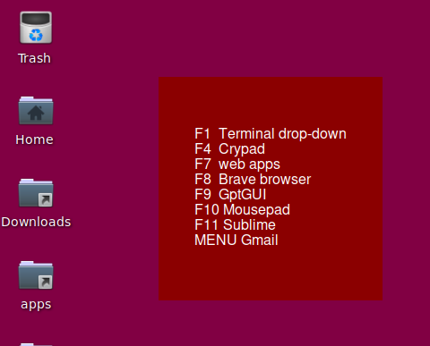

# Message-GUI
Python/tkinter  
Displays a timmed message on screen.




```bash
$ python3 tkdisp.py 'hello and goodbye until we meet again!' 5

$ display "/home/Hotkeys.txt" -f -g "250x250+200+100" 9

```
Note `display` is a bash script.

---

tkdisp.py uses python3, tkinter and argparse.

### Displays a text message in a GUI window for n [milli]seconds
```text
usage: tkdisp.py [-h] [-g GEOMETRY] [-bg BKGRD] [-fg FRGRD] [-fn FONT] [-fs FSIZE] [-b]
                 [-i] [-f] msg tim
                 
positional arguments:
  msg                   the message to be displayed
  tim                   milliseconds to display message

options:
  -h, --help            show this help message and exit
  -g GEOMETRY, --geometry GEOMETRY
                        WxH+left+top | size and position of window
  -bg BKGRD, --bkgrd BKGRD
                        background color of message window
  -fg FRGRD, --frgrd FRGRD
                        foreground color of message text
  -fn FONT,  --font FONT
                        font family name of text
  -fs FSIZE, --fsize FSIZE
                        font size of message text
  -b, --bold            bold font for message text
  -i, --italic          italic font for message text
  -f, --isFile          msg is a filepath to a text file
```
---

Note: all flags (except -f) have defaults. _msg_ and _tim_ are required.

A mouse click on the displayed message will close it immediately.

```bash
# my 'display' script  
python3 /path.../tkdisp.py "$1" $2 $3 $4 $5 $6 $7 $8 $9 $a $b $c $d $e $f
```


